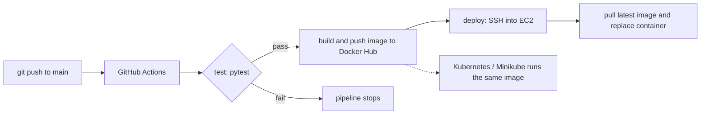

# Todo API: Containerized Flask App with CI/CD, Kubernetes and Terraform

A small Flask REST API used as the base for a hands-on DevOps project. The app is intentionally simple. The focus is everything around it: containerization, an automated test → build → deploy pipeline, deployment to AWS EC2, Kubernetes, and infrastructure as code with Terraform.

**Docker Hub image:** [`anjalimv0169/todo-api`](https://hub.docker.com/r/anjalimv0169/todo-api)

## What this project demonstrates

| Area | What was built |
|---|---|
| Application | Flask REST API with CRUD endpoints and a health check |
| Testing | Pytest suite that gates every build |
| Containers | Dockerfile with a slim Python base, layer-cached installs, `.dockerignore` |
| CI/CD | GitHub Actions: test → build and push to Docker Hub → deploy to EC2 over SSH |
| Cloud | AWS EC2 (Ubuntu) with security-group rules and key-pair access |
| Orchestration | Kubernetes (Minikube): Deployment, NodePort Service, scaling, rolling updates, self-healing |
| Infrastructure as Code | Terraform: security group and EC2 instance (init, plan, apply, destroy) |

## Architecture



## API endpoints

| Method | Endpoint | Description |
|---|---|---|
| GET | `/health` | Health check, returns status and version |
| GET | `/todos` | List all todos |
| POST | `/todos` | Add a todo (JSON body, e.g. `{"task": "learn docker"}`) |
| DELETE | `/todos/<index>` | Delete a todo by its list index |

Todos are stored in memory, so they reset whenever the app or container restarts.

## Run it locally

```bash
python3 -m venv venv
source venv/bin/activate        # Windows Git Bash: source venv/Scripts/activate
pip install -r requirements.txt
python app.py
```

Then try it:

```bash
curl http://127.0.0.1:5000/health
curl -X POST http://127.0.0.1:5000/todos -H "Content-Type: application/json" -d '{"task": "learn docker"}'
curl http://127.0.0.1:5000/todos
```

## Run the tests

```bash
pytest
```

## Run with Docker

Build locally:

```bash
docker build -t todo-api .
docker run -d -p 5000:5000 --name todo-api-container todo-api
```

Or pull the published image:

```bash
docker pull anjalimv0169/todo-api
docker run -d -p 5000:5000 anjalimv0169/todo-api
```

## CI/CD pipeline

The workflow in `.github/workflows/docker-build.yml` runs on every push to `main` and has three jobs. Each job depends on the previous one, so a failing test stops the build and the deployment.

1. **test**: installs dependencies and runs `pytest`
2. **build-and-push**: builds the Docker image and pushes it to Docker Hub
3. **deploy**: SSHes into the EC2 instance, pulls the new image, and replaces the running container

Credentials are stored as GitHub Actions secrets, never in the code:

| Secret | Purpose |
|---|---|
| `DOCKERHUB_USERNAME` | Docker Hub username |
| `DOCKERHUB_TOKEN` | Docker Hub access token (not the account password) |
| `EC2_HOST` | Public IP of the EC2 instance |
| `EC2_SSH_KEY` | Full contents of the `.pem` private key |

> The EC2 public IP changes whenever the instance is stopped and started, so `EC2_HOST` must be updated after a restart (an Elastic IP would avoid this).

## Kubernetes (Minikube)

Manifests: `k8s-deployment.yml` (2 replicas) and `k8s-service.yml` (NodePort).

```bash
minikube start --driver=docker
kubectl apply -f k8s-deployment.yml
kubectl apply -f k8s-service.yml
kubectl get pods
minikube service todo-api-service --url
```

Things tried on the cluster:

- **Self-healing:** deleted a pod with `kubectl delete pod <name>` and watched the Deployment create a replacement.
- **Scaling:** `kubectl scale deployment todo-api --replicas=4`, then back to 2.
- **Rolling update:** changed the app, rebuilt and pushed the image, loaded it with `minikube image load`, then ran `kubectl rollout restart deployment todo-api` and followed it with `kubectl rollout status`.

## Terraform

The `terraform/` folder contains `main.tf`, which creates a security group (SSH, HTTP and port 5000) and a `t3.micro` Ubuntu EC2 instance, and prints its public IP.

```bash
cd terraform
terraform init
terraform plan
terraform apply
terraform destroy      # removes everything it created
```

Requirements: the AWS CLI configured with credentials, and an existing EC2 key pair whose name matches `key_name` in `main.tf`. The AMI ID is region-specific, so check it if you use a different region.

## Project structure

```
.
├── app.py                      # Flask application
├── test_app.py                 # Pytest tests
├── requirements.txt
├── Dockerfile
├── .dockerignore
├── k8s-deployment.yml          # Kubernetes Deployment
├── k8s-service.yml             # Kubernetes Service
├── terraform/
│   └── main.tf                 # AWS security group + EC2 instance
└── .github/workflows/
    └── docker-build.yml        # CI/CD pipeline
```

## Problems I ran into and how I fixed them

- **Pipeline failed with "pytest: command not found":** `pytest` was missing from `requirements.txt`, so the CI environment never installed it. Fixed by adding it to the requirements.
- **Pipeline ran "no tests":** `test_app.py` had never been committed. Fixed by adding and pushing it.
- **Merge conflict in the workflow file:** caused by editing the workflow both locally and on GitHub. Resolved by rewriting the file cleanly and committing the merge.
- **SSH timeout to EC2:** the security group allowed only my old IP. Fixed by updating the SSH rule.
- **Pods stuck in `ContainerCreating` on Minikube:** slow image pulls. Worked around by loading the already-built local image with `minikube image load`.

## Known limitations

- Todos are stored in memory and are not persisted.
- The app runs on Flask's built-in development server. A production setup would use a WSGI server such as Gunicorn.
- No HTTPS or authentication.
- The security group allows SSH from anywhere for convenience while learning. A real setup would restrict it.
- Kubernetes ran on a local Minikube cluster, not a managed cloud cluster.

## Author

Anjali M V: [GitHub](https://github.com/Anjalimv2001) · [LinkedIn](https://linkedin.com/in/anjali-m-v-a357a723b)
