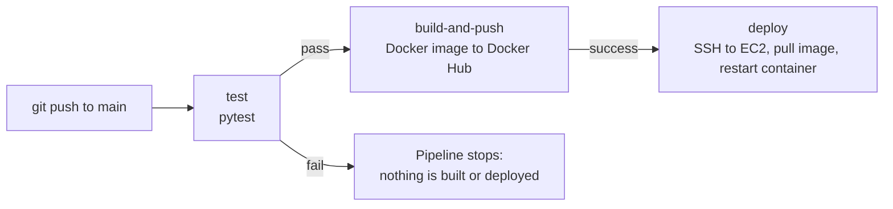

# Todo API: Flask + Docker + CI/CD on AWS

A small Flask REST API used as a hands-on DevOps project. Every push to `main` is **tested, built into a Docker image, pushed to Docker Hub, and deployed to an AWS EC2 server automatically**, with no manual steps.


## Pipeline at a glance



| Stage | What it does |
|---|---|
| **test** | Installs dependencies and runs the Pytest suite. If any test fails, the later stages never run. |
| **build-and-push** | Builds the Docker image and pushes it to Docker Hub as `anjalimv0169/todo-api:latest`. |
| **deploy** | Connects to the EC2 instance over SSH, pulls the new image, removes the old container, and starts the new one. |

## Tech stack

- **App:** Python 3.11, Flask
- **Testing:** Pytest
- **Containers:** Docker (slim Python base image, `.dockerignore`, layer-cached dependency install)
- **CI/CD:** GitHub Actions
- **Registry:** Docker Hub
- **Hosting:** AWS EC2 (Ubuntu), security group with SSH, HTTP, and app-port rules
- **Orchestration:** Kubernetes (Minikube)
- **Infrastructure as code:** Terraform

## API endpoints

| Method | Endpoint | Description |
|---|---|---|
| GET | `/health` | Health check, returns `{"status": "ok"}` |
| GET | `/todos` | List all todos |
| POST | `/todos` | Add a todo (JSON body, e.g. `{"task": "learn docker"}`) |
| DELETE | `/todos/<index>` | Delete a todo by its position in the list |
| GET | `/health` | Returns `{"status": "ok", "version": "v2"}` |

> Todos are stored in memory, so they reset when the container restarts. The goal of this project is the delivery pipeline, not the data layer.

## Run it locally

**With Docker (quickest):**

```bash
docker pull anjalimv0169/todo-api
docker run -d -p 5000:5000 --name todo-api anjalimv0169/todo-api
curl http://localhost:5000/health
```

**Without Docker:**

```bash
python -m venv venv
source venv/bin/activate        # Windows Git Bash: source venv/Scripts/activate
pip install -r requirements.txt
python app.py
```

**Run the tests:**

```bash
pytest
```

## Project structure

```
todo-api/
├── app.py                          # Flask application
├── test_app.py                     # Pytest tests
├── requirements.txt                # Python dependencies
├── Dockerfile                      # Container image definition
├── .dockerignore                   # Files excluded from the image
└── .github/workflows/
    └── docker-build.yml            # test -> build-and-push -> deploy pipeline
├── k8s-deployment.yml              # Kubernetes Deployment (2 replicas)
├── k8s-service.yml                 # Kubernetes NodePort Service
├── terraform/                      # Terraform: security group + EC2
```

## Setting up the pipeline yourself

Add these under **Settings → Secrets and variables → Actions**:

| Secret | Purpose |
|---|---|
| `DOCKERHUB_USERNAME` | Docker Hub username |
| `DOCKERHUB_TOKEN` | Docker Hub access token (not your password) |
| `EC2_HOST` | Public IP or DNS of the EC2 instance |
| `EC2_SSH_KEY` | Full contents of the EC2 `.pem` private key |

The EC2 instance needs Docker installed and its security group must allow SSH (22) and the app port (5000).

## Kubernetes (Minikube)

Manifests: `k8s-deployment.yml` (2 replicas) and `k8s-service.yml` (NodePort service).

```bash
minikube start --driver=docker
kubectl apply -f k8s-deployment.yml
kubectl apply -f k8s-service.yml
kubectl get pods
minikube service todo-api-service --url
```

Tested on a local cluster:
- **Self-healing:** deleted a pod and Kubernetes recreated it automatically
- **Scaling:** `kubectl scale deployment todo-api --replicas=4`
- **Rolling update:** rebuilt the image and ran `kubectl rollout restart deployment todo-api` with no downtime

## Terraform

`terraform/main.tf` defines an AWS security group (SSH, HTTP, port 5000) and a t3.micro Ubuntu EC2 instance.

```bash
cd terraform
terraform init
terraform plan
terraform apply
terraform destroy
```

Requires AWS credentials (`aws configure`) and an existing EC2 key pair named `todo-api-key`. Terraform state files are git-ignored.

## What I learned

- Making the deploy stage depend on the test stage means a bad commit can never reach the server.
- Credentials live in GitHub Secrets, never in the repository.
- A "connection timed out" over SSH was a security-group rule locked to an old IP address, not a problem with the key or the command.
- Merge conflicts in workflow files, and a missing `pytest` entry in `requirements.txt`, both broke the pipeline. Reading the failed job logs is what led to each fix.

## Ideas for next steps

- Elastic IP so the deploy target does not change when the instance restarts
- Restrict SSH access to a fixed range and move to a non-root deployment user
- Replace the in-memory list with a database
- Deploy to Kubernetes and define the AWS infrastructure with Terraform

---

Built by **Anjali M V** as a hands-on DevOps learning project.
